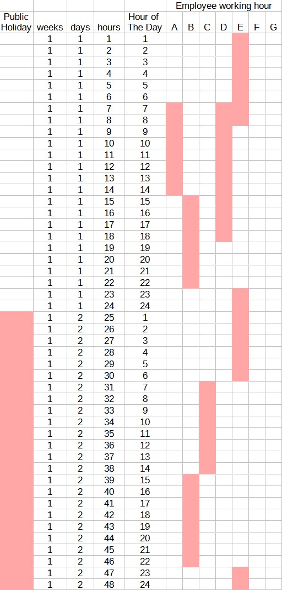
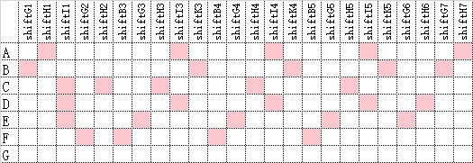
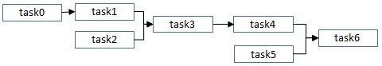
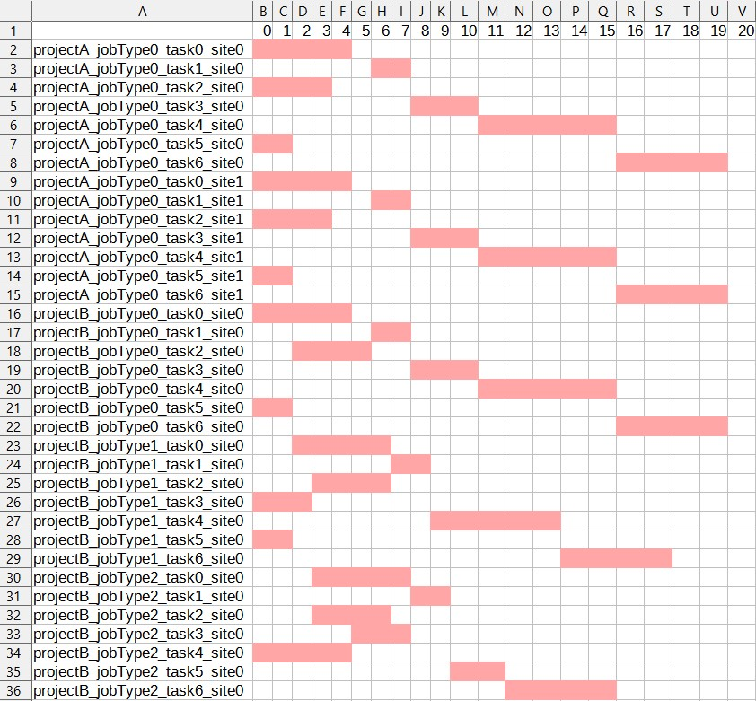
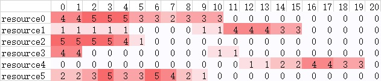

# using pyomo for shift planning

The lightweight software can plan shifts for multiple operators with custom-defined shifts, labor law constraints, and operators' personal preferences to reach weekly demand. The objective can be low labor cost or high preference match. Input and output can be excel or txt. 

Dummy input files are in `resources\input\assignment`.

Output files in `resources\output\assignment`.

Log files in `logs\assignment`.

## use case

n operators need to be matched to m shifts to fulfill demand every week, and account for personal preferences while keeping the labor cost low. Unit is hour, planning horizon is one week (168 hours).

The department has shift definitions in an input file. Each shift is 8-12 hours, and one shift can be across different days.

Each operator needs to exceed minimum hours or number of shifts, and be below maximum hours or number of shifts. Every operator has inidividual hourly wage and efficiency output. Every operator can input their preferences for certain shifts. If preference is zero, the operator will not be scheduled for that shift. They can also specify availability (e.g., vacation days). 

Demand is another input from the department. There is also the min demand and max demand, the solution will be relaxed to be between min and max in the hour, but meeting total weekly demand.

Regulation sheet:

- min/max hours and number of shifts per person per week
- min hours between shifts for one person
- min number of same shifts per week (to make sure operators don't switch between day and night shifts too often)
- max number of night shifts
- definition of a night shift
- base hourly wage, night shift / over time / weekend / holiday hourly wage
- weight for preference (e.g., more senior operators' preferences are more important)
- weight for operations cost (labor cost)

## input data

**Demand**:

name         |example|description
----         |-------|-----------
publicHoliday|0      |1 is holiday，0 is normal day
weeks        |1      |week index
days         |1      |1-7, 1 is Monday，7 is Sunday
hours|1|increments from 1, hour index
hourPerDay|1|1-24,1 is the 0-1st hour of the day，24 is the 23-24th hour of the day
demand|2|average demand in number of products per hour
min|1|mininum demand
max|4|maximum demand
 
The shift plan will meet total demand in the week, with flexibility each hour between minDemand and maxDemand.

**Shift**：

name|example|description
----|----|----
weeks|1|week index
days|1|1-7, 1 is Monday
hours|1|hour index
hourPerDay|1|1-24, hour of the day
shiftA|1|1 is the hour occupied by shiftA
shiftB|0|1 is the hour occupied by shiftB

The input is only shifts in 24 hours, default is every day of the week, shift definition is the same. According to demand, shift may be assigned more operators, or left empty.

example:

weeks|days|hours|hourPerDay|shiftA|shiftB|shiftC|shiftD|shiftE|shiftF|shiftG|shiftH|shiftI|shiftJ|shiftK
-----|----|-----|----------|------|------|------|------|------|------|------|------|------|------|------
1|1|1|1|1|0|0|1|0|0|1|0|0|0|0
1|1|2|2|1|0|0|1|0|0|1|0|0|0|0
1|1|3|3|1|0|0|1|0|0|1|0|0|0|0
1|1|4|4|1|0|0|1|0|0|1|0|0|1|0
1|1|5|5|1|0|0|1|0|0|1|0|0|1|0
1|1|6|6|1|0|0|1|0|0|1|0|0|1|0
1|1|7|7|0|1|0|1|1|0|1|0|1|1|0
1|1|8|8|0|1|0|1|1|0|1|0|1|1|0
1|1|9|9|0|1|0|0|1|0|1|0|1|1|0
1|1|10|10|0|1|0|0|1|0|1|0|1|1|0
1|1|11|11|0|1|0|0|1|0|1|0|1|1|0
1|1|12|12|0|1|0|0|1|0|1|0|1|0|0
1|1|13|13|0|1|0|0|1|0|0|1|1|0|0
1|1|14|14|0|1|0|0|1|0|0|1|1|0|0
1|1|15|15|0|0|1|0|1|1|0|1|1|0|1
1|1|16|16|0|0|1|0|1|1|0|1|1|0|1
1|1|17|17|0|0|1|0|0|1|0|1|1|0|1
1|1|18|18|0|0|1|0|0|1|0|1|1|0|1
1|1|19|19|0|0|1|0|0|1|0|1|0|0|1
1|1|20|20|0|0|1|0|0|1|0|1|0|0|1
1|1|21|21|0|0|1|0|0|1|0|1|0|0|1
1|1|22|22|0|0|1|0|0|1|0|1|0|0|1
1|1|23|23|1|0|0|1|0|1|0|1|0|0|0
1|1|24|24|1|0|0|1|0|1|0|1|0|0|0

**Availability**:

name|example|description
----|----|----
publicHoliday|0|1 is public holiday
weeks|1|week index
days|1|1-7, 1 is Monday
hours|1|hour index
hourPerDay|1|1-24, hour of the day
A|1|operator A's availability,1 is available,0 is vacation
B|1|operator B's availability,1 is available,0 is vacation

**Preference**

Operator ID in this input file must correspond to availability file, shift ID must correspond to all shift IDs in the week. 

A bigger value means higher preference. If preference is 0, the operator will not be assigned in that shift.

name|example|description
----|----|----
employees|A|operator ID
employeeHourlyWage|1|hourly wage
employeeHourlyOutput|1|efficiency in pieces
employeePriority|7|importance of the operator's preference
shiftA1|1|operator preference for day 1 shiftA, range is 0-3
shiftB1|3|operator preference for day 1 shiftB, range is 0-3
shiftA2|1|operator preference for day 2 shiftA, range is 0-3
shiftB2|3|operator preference for day 2 shiftB, range is 0-3

**Regulation**

name|example|unit|description
--------|----|----|----  
minWorkHour|35|hours|min work hour per week per person, vacations and holidays automatically deducted
maxWorkHour|60|hours|max work hour per week per person  
minShiftsPerWeek|3|shifts|min shift per week per person, vacations and holidays automatically deducted
maxShiftsPerWeek|5|shifts|max shift per week per person  
minHourBetweenShift|12|hours|min hour between shifts for each operator  
minShiftContinuous|2|days|mininum number of shifts in a week that has the same time  
minNightShiftContinuous|3|days|If night shift, then minimum number of continuous night shifts per person  
nightShiftDefinitionStart|24|hour|night shift definition, start. Any shift with overlap with the definition is considered night shift.  
nightShiftDefinitionEnd|4|hour|night shift definition, end.  
maxNightShiftContinuous|5|days|If night shift, then max number of continuous night shifts per person  
standardShiftCostPerPersonPerHour|1|unit|base wage. 1 is 100%
standardShiftPaymentStart|0|hour|time frame for base wage, start  
standardShiftPaymentEnd|24|hour|time frame for base wage, end
additionalNightShiftCost|1|unit|night shift extra wage  
additionalNightShiftPaymentStart|22|hour|time frame for nightshift wage, start  
additionalNightShiftPaymentEnd|6|hour|time frame for nightshift wage, end
additionalWeekendShiftCost|1|unit|weekend extra wage  
additionalWeekendDayStart|6|Saturday|time frame for weekend wage, start  
additionalWeekendDayEnd|7|Sunday|time frame for weekend wage, end  
additionalPublicHolidayCost|1|unit|holiday extra wage  
weightPreference|0.1|unit|weight for operator preference, 0-1  
weightCost|0.9|unit|weight for operation cost, 0-1

## output data

**schedule**：operator vs. hours, 1 is work, 0 is free. Example:

**shift assignment**：operator vs. shift, 1 is assigned, 0 is not assigned. Example:

# using pyomo for project planning

A lightweight software for gantt chart planning of projects with resource contraint. The optimization aims at 1. fulfill project deadline, 2. plan according to project priority, 3. maximize multiple objectives with custom weights. 

The software uses open source tools and solvers. It supports excel or txt format inputs and outputs.

Dummy input files are in `resources\input\jobshopScheduling`.

Output files in `resources\output\jobshopScheduling`.

Log files in `logs\jobshopScheduling`.

## use case

The business wants to plan for multiple projects. Each project has several tasks of a certain job type, and the tasks have to be done in a sequence (routing). In each stage of the project, the task has to be done in a certain geological site. Different projects can have the same type of tasks.

Each task type requires a certain amount of different resources, including required amount of the resource, and required time (e.g., requirement for 1 specialist for 3 days). Each resource has maximum capacity in any time period. Within the maximum capacity, the resource can be shared between tasks.

The business wants total time span of all projects are minimized, but the start date is flexible.

## data

### input data

- planHorizon: total time during to plan the projects. For example, if planning unit is days, and the planning horizon is a year, then this parameter can be 365.
- planStrategy: the strategy of "earliest" or "latest". If set to "earliest", then the software tries to plan all tasks as early as possible in the plan horizon. 

**routing**: upstream and downstream dependency between tasks

name|description
------|---
job_idx|ID of the job type. Each "job type" has a unique sequence of tasks. Each project can have multiple job types.
task_idx|upstream task ID (the prerequisite)
post_task_idx|downstream task ID
interval|required time between two tasks.

An example:

In data:

task_idx|post_task_idx|interval
--------|-------------|-------
task0|task1|2
task1|task3|1
task2|task3|1
task3|task4|1
task4|task6|1
task5|task6|1
task6|taskEnd|1

**resource**：Resource requirements for each task, rows are task IDs, columns are resource IDs.

Example:

tasks|resource0|resource1|resource2|resource3|resource4|resource5
-----|-|-|-|-|-|-
task0|5|0|3|0|0|0
task1|0|0|0|0|0|2
task2|0|0|2|0|0|4
task3|3|0|0|0|0|0
task4|0|5|0|0|0|0
task5|0|0|0|2|0|0
task6|0|0|0|0|4|0

**hierarchy**：relationship between projects and job types

One project can include many job types, and each job type can be repeated many times during a project. For example, for a telecom company, one project can have job types "build new" and "extend capacity", with 100 and 50 sites, respectively. Prioritized jobs/sites will be planned earlier.

name|description
------|---
project_idx|project ID
job_idx|job ID
count|number of jobs
jobTypePriority|job type priority

Example:

project_idx|job_idx|count|jobTypePriority
-----------|-------|-----|---------------
projectA|jobType0|2|10
projectB|jobType0|1|5
projectB|jobType1|1|3
projectB|jobType2|1|1

**cost**：resource costs.

name|description
------|---
resource_idx|resource ID
unitCost|cost of resource per time unit
resourceCapa|capacity of resource in any time unit

### output

**startTime**：only includes start time of tasks

**actualDuration**：planning of all tasks, including start and end time, resource usage, etc. 

Example:

**resourceUsed**: resource information

Example:

### Other constraints

1. Feasibility check if all resources can meet all resource demands. There is the possibility of setting a multiplier to make sure there is feasible solution.

2. Hard constraints:
 
  - every task-resource pair has to respect resource requirement
  - tasks can only start once
  - resource usage in any time unit has to be below capacity
  - tasks have to respect dependency defined in routing
  - tasks have to respect intervals in between

